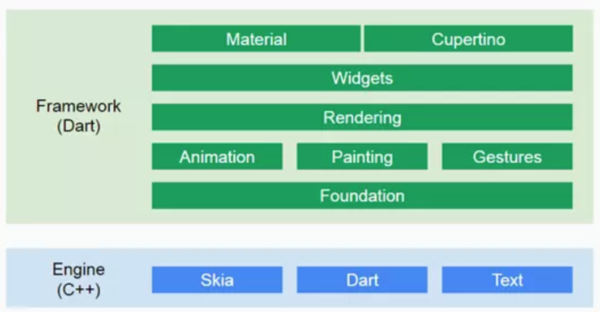

## 一 跨平台不是伪需求  

每个平台的诞生都是其背后一套技术体系的长期支撑的结果，相应的为了能更好的适应该平台的发展、更新，开发者在开发该平台应用时也一般会选择配套的技术体系。  

这似乎是软件业长期发展以来的一个无可避免的结果。但是前几年移动互联网的普及，让我们看到一个企业如果想成功开拓移动市场，安卓、iOS、小程序三者一个都不能少。同一个应用，需要三个前端开发团队支持，对企业来说，付出的成本是巨大的。  

对开发者来说，单一平台也会限制个人的技术成长与发展。  

跨平台需求无论对企业、对技术人员来说都是切切实实的需求！  

## 二 跨平台几个时代

#### 2.1 Hybrid时代

HybridAPP是在原生应用基础上，与web应用互相结合。APP的整体架构、功能都是由原生技术体系实现，而部分类似页面展示这样的轻量级功能交给组件WebView实现。  

WebView以及基于该技术封装的框架，都提供了统一的JavaScriptAPI给开发这调用，用网页的形式在APP中展示内容。  

常见的Hybrid框架有：
- ionic：该技术底层使用Cordova打包（基于多年前的Adobe公司的PhoneGap平台），前端使用AngularJS框架，可以完全使用HTML+CSS+JavaScript方式开发APP应用。我们可以粗略理解为：开发的APP类似于内置了浏览器引擎，app内容完全由该引擎驱动展示，开发技术体系自然也都是web前端体系了。
- 国产的一些跨平台体系：如DCloud

#### 2.2 编译转换时代

Hybrid技术体系最大的缺点是性能不足、兼容性问题严重。为了解决这些问题，JavaScript诞生了一些框架，使用这些框架以及web技术开发出来的应用，在UI层通过桥接等方式间接生成了原生UI，使用户体验大幅度提升。  

就像该领域的领军者Facebook所说的：Learn Once，Write EveryWhere。  

常见的编译转换技术有：
- reactnative：facebook公司基于react编写的移动端跨平台开发框架，UI层会被编译为原生APP的UI，性能提升明显。  
- weex：基于vue开发的移动端跨平台框架，在阿里使用较多

#### 2.3 flutter时代

笔者将这三个技术都称呼为时代，是坚信flutter是新的跨平台开发潮流。跨平台既然是真需求，那么对应技术也自然是求之不得，无非是使用上的好坏、健全与否而已。  

flutter是谷歌于2015年开始立项的产品，不依赖于原生平台，它有自己的Skia渲染引擎，通过这个可移植的 GPU 加速的渲染引擎以及高性能本地 ARM 代码运行时，达到跨设备跨平台的高质量用户体验（高帧率60bps），笔者认为这才是当前能够预见到的最好的跨平台方案。  

## 三 flutter简介  

#### 3.1 flutter特点

flutter是基于Dart语言开发的一款框架，用于构建iOS和Andoid等平台的UI，其生成的UI是高质量的**原生**用户界面 

博主认为的flutter最大卖点：
- 跨平台：其跨平台完全不同于当前的两种成熟实现方式：ionic（移动端内嵌chrome），reactnative（js桥接，将前端view生成为原生view），flutter使用GPU渲染方式，完全由自己实现GDI，官方说法是可达120fps
- 热重载：修改源码，无需编译，保存后直接就能在模拟器中查看修改结果，这能极大提升开发效率

#### 3.2 flutter架构

flutter基本框架：flutter框架包含两层，分别是框架层（Framework），引擎层（Engine），如图所示：  

  

框架层：由Dart语言编写，提供了大量的API供开发者开发项目，包如下主要功能：
- Material：Material Design风格组件
- Cupertino：针对iOS风格的组件
- Widgets：核心组件
- Rendering：渲染
- Animation：动画
- Painting：绘制
- Gestures：手势
- Foundation：基础库

引擎层：由C++语言编写，包含以下三个部分：
- Skia：核心库，图形渲染引擎
- Dart：Dart虚拟机，提供Dart编译运行环境
- Text：文本渲染

## 四 fluttter环境安装

#### 4.0 基础环境要求

在配置flutter环境之前，需要安装java、git环境。  

注意：mac需要提前安装 Xcode 7.2 或者以上版本。  

flutter下载地址：https://flutter.dev/docs/development/tools/sdk/releases 

#### 4.1 win安装

前奏：由于flutter等工具下载时会遇到网络问题，推荐使用一些镜像：
```
export PUB_HOSTED_URL=https://pub.flutter-io.cn
export FLUTTER_STORAGE_BASE_URL=https://storage.flutter-io.cn
```

步骤一：解压安装，配置环境
```
# 解压安装:将下载的win版本flutter安装包解压到 C:\Dev\flutter

# 配置环境变量：将flutter命令配置为全局使用

# 测试flutter
flutter -h          # 需要时间较长                                              
```

步骤二：检测环境
```
flutter doctor      # 检测flutter环境命令

# 根据 检测要求进行缺失环境安装，比如安装证书：
flutter doctor --android-licenses
```

步骤三：AndroidStudio安装，这是目前最好的flutter开发工具，https://developer.android.com/
```
# 安装flutter插件：打开AndroidStudio--Preference--Plugins--搜索flutter---install即可

# 启动AndroidStudio，并 create a new  flutter project，注意此时会去下载谷歌gradle，速度极慢，耐心等待，失败后反复试验

```

#### 4.2 mac安装

前奏：由于flutter等工具下载时会遇到网络问题，推荐使用一些镜像：
```
export PUB_HOSTED_URL=https://pub.flutter-io.cn
export FLUTTER_STORAGE_BASE_URL=https://storage.flutter-io.cn
```

步骤一：解压安装，配置环境
```
# 解压安装
cd ~                                                            # 假设安装在该用户目录下
unzip ~/Downloads/flutter_macos_v1.2.1-stable.zip               # flutter安装包下载位置

vim ~/.bash_profile
# 添加
export PUB_HOSTED_URL=https://pub.flutter-io.cn                 # 国内用户需要设置
export FLUTTER_STORAGE_BASE_URL=https://storage.flutter-io.cn   # 国内用户需要设置
export PATH=~/flutter/bin:$PATH

source ~/.bash_profile

# 注意，如果使用的是zsh，需要 vim ~/.zshrc，添加上述命令，添加：source ~/.bash_profile

# 测试安装是否成功
flutter -h          # 需要时间较长                                              
```

步骤二：检测环境
```
flutter doctor      # 检测flutter环境命令

# 根据 Android toolchain 一栏要求执行下列命令：
flutter doctor  --android-licenses

# 根据 iOS toolchain 一栏以下的提示依次安装缺失组件
```

步骤三：AndroidStudio安装，这是目前最好的flutter开发工具，https://developer.android.com/
```
# 安装flutter插件：打开AndroidStudio--Preference--Plugins--搜索flutter---install即可

# 启动AndroidStudio，并 create a new  flutter project，注意此时会去下载谷歌gradle，速度极慢，耐心等待，失败后反复试验

```

## 五 运行flutter项目

如果想要使用iOS虚拟机，那么你的电脑必须是MacOS，在AS软件上直接可以启动iOS虚拟机（因为你已经安装了Xcode）  

如果想要使用安卓虚拟机，无论是mac，还是win，都需要安装AVD虚拟机：
```
# 点击Android Studio中的上方菜单tool -AVD Manager选项。出现新建菜单，选择Create Virtual Device.....依次走下去即可
```

步骤五：运行flutter工程
```
# 点击debug按钮，让Flutter程序跑起来，或者直接点击 run 按钮，其实是执行：flutter run
```

## 六 flutter更新

升级flutter命令：
```
flutter upgrade
```

如果只想升级依赖，而不升级flutter：
```
flutter packages get        # 获取pubspec.yaml文件中列出的所有依赖包
flutter packages upgrade    # 获取pubspec.yaml文件中列出的所有依赖包的最新版本
```

如果想切换flutter的分支：
```
# 可以在pubspec.yaml文件中指定Flutter SDK的依赖项,例如，以下代码片段指定flutter和flutter_test包使用Flutter SDK。

name: hello_world
dependencies:
  flutter:
    sdk: flutter
dev_dependencies:
  flutter_test:
    sdk: flutter
```

贴士：  
不要使用pub get或pub upgrade命令来管理你的依赖关系。相反，应该使用flutter packages get或flutter packages upgrade。如果您想手动使用pub，则可以通过设置FLUTTER_ROOT环境变量来直接运行它。

## 七 一些错误贴士

贴士一：  
一定要通过flutter doctor命令来安装dart运行时环境，不要直接下载dart安装包到flutter安装目录中。   

贴士二：
首次创建flutter项目无法进入，可以关闭AS进程，在AS安装目录中的bin文件夹内找到idea.properties文件，追加如下代码：
```
disable.android.first.run=true    # 禁用更新的意思
```


出现：`Waiting for another flutter command to release the startup lock.`解决：
```
# 杀死一切dart进程
# 删除(your_flutter_directory/flutter/bin/cache/lockfile)
# 重启 AS
```