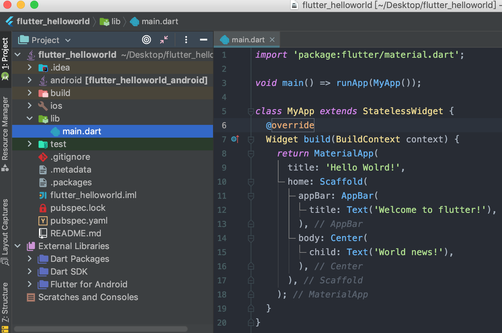

## 一 创建HellowWorld程序

在01章节新建的flutter基础项目中，由于是AS帮助创建的，我们将/lib目录下的`main.dart`内容修改为一个HelloWorld项目：
```dart
import 'package:flutter/material.dart';             // 导包

void main() => runApp(MyApp());                     // 入口函数

class MyApp extends StatelessWidget {               // 应用继承自无状态组件
  @override
  Widget build(BuildContext context) {              // 返回一个组件
    return MaterialApp(                              // 返回 MaterialApp 这个组件
      title: 'Hello Wolrd!',
      home: Scaffold(                               // home是窗口的主体，可以使用脚手架组件Scaffold搭建内容
        appBar: AppBar(   
          title: Text('Welcome to flutter!'),
        ),
        body: Center(                               // Center是个布局组件
          child: Text('World news!'),
        ),
      ),
    );
  }
}
```

执行AS的run，即可展示helloworld项目。

## 二 HellowWorld程序整体概览

#### 2.0 目录介绍

helloworld项目截图：
  

常用文件与目录：
- lib：flutter应用目录，工程代码放在此处
- ios/android：flutter与原生交互时代码目录
- pubspec.yaml：项目依赖文件

#### 2.1 入口文件

`/lib`目录下的一个main.dart文件，都会有且仅有一个main()函数，该函数是flutter项目的入口函数。  

`void main() => runApp(Widget app)`其实是dart的语法糖，原本格式是：
```
void main() {
    return runApp(Widge app);
}
```

如果不调用`runApp()`函数，那么该用用将会是一个执行dart的控制台应用，因为`runApp`其实是框架Flutter的入口。

#### 2.2 Material Design设计风格

`Material Design`是谷歌推出的一台视觉设计语言，每一个dart文件第一行几乎都会导入`flutter/material.dart`包。  

该包是`Material Design`的基础包，里面包含文本输入框Text、图标Icon、图片Image、行排列布局Row、列排列布局Column、装饰器Decoration、动画等组件。 

## 三 主题使用

#### 3.0 主题是什么

为了在整个应用中使用同一套颜色和字体样式，可以使用主题这种方式。定义主题有两种方式：
- 全局主题：
- Theme自定义：可以设置应用程序局部的颜色和字体样式

其实全局主题就是应用程序根M`MaterialApp`创建的主题Theme。  

定义主题后，就可以在我们自己的Widget中使用它，Flutter提供的`Material Widgets`将使用主题为AppBars、Buttons、Checkboxes等设置背景颜色和字体样式。  

#### 3.1 创建应用主题

创建主题的方式是将ThemeData提供给MaterialApp构造函数，这样就可以在整个应用程序中共享包含颜色和字体样式的主题。   

定义一个全局主题：
```dart
new MaterialApp(
    title: title,
    theme: new ThemeData(
        brightness: Brightness.dark,
        primaryColor: Colors.lightBlue[800],
    ),
);
```

定义一个局部主题：
```dart
new Theme(
    data: new ThemeData(
        accentColor: Colors.yellow,
    ),
    child: new Text('Hello World'),
);
```

扩展主题：使用copyWith方法
```dart
new Theme(
    data: Theme.of(context).copyWith(accentColor: Colors.yellow),   // 覆盖accentColor为Colors.yellow
    child: new Text('use copyWith method'),
);
```

主要的ThemeData：
```dart
ThemeData({
  Brightness brightness, //深色还是浅色
  MaterialColor primarySwatch, //主题颜色样本，见下面介绍
  Color primaryColor, //主色，决定导航栏颜色
  Color accentColor, //次级色，决定大多数Widget的颜色，如进度条、开关等。
  Color cardColor, //卡片颜色
  Color dividerColor, //分割线颜色
  ButtonThemeData buttonTheme, //按钮主题
  Color cursorColor, //输入框光标颜色
  Color dialogBackgroundColor,//对话框背景颜色
  String fontFamily, //文字字体
  TextTheme textTheme,// 字体主题，包括标题、body等文字样式
  IconThemeData iconTheme, // Icon的默认样式
  TargetPlatform platform, //指定平台，应用特定平台控件风格
  ...
})
```

上面只是ThemeData的一小部分属性，完整列表读者可以查看SDK定义。上面属性中需要说明的是primarySwatch，它是主题颜色的一个样本，通过这个样本可以在一些条件下生成一些其他的属性，例如，如果没有指定primaryColor，并且当前主题不是深色主题，那么primaryColor就会默认为primarySwatch指定的颜色，还有一些相似的属性如accentColor、indicatorColor等也会受primarySwatch影响。  

#### 3.2 使用主题

函数Theme.of(context)可以通过上下文来获取主题，其内部会查找最近的主题，如果找不到就会查找整个应用的主题。

下面是一个HelloWorld项目的完整示例，首先我们在与 main.dart的同级目录下创建一个自定义的dart文件：`MyHomePage.dart`，在该文件自定义一个界面对象MyHomePage：  


MyHomePage代码如下：
```dart
import 'package:flutter/foundation.dart';
import 'package:flutter/material.dart';

class MyHomePage extends StatelessWidget {

  final String title;

  MyHomePage({Key key, @required this.title}) : super(key: key);

  @override
  Widget build(BuildContext context) {
    return new Scaffold(

      appBar: new AppBar(
        title: new Text(title),
      ),

      body: new Center(
        child: new Container(
          color: Theme.of(context).accentColor,     // 获取主题的accentColor
          child: new Text(
            '带有背景色的文本组件',
            style: Theme.of(context).textTheme.title,
          ),
        ),
      ),

      floatingActionButton: new Theme(
          data: Theme.of(context).copyWith(accentColor: Colors.green),
          child: new FloatingActionButton(onPressed: null, child: new Icon(Icons.computer),)
      ),
      
    );
  }

}
```

main.dart代码如下：
```dart
import 'package:flutter_helloworld/MyHomePage.dart';
import 'package:flutter/material.dart';

void main() => runApp(new MyApp());

class MyApp extends StatelessWidget {

  @override
  Widget build(BuildContext context) {

    final appName = '自定义主题';

    var appTheme = new ThemeData(
      brightness: Brightness.light, // 应用程序整体主题的亮度
      primaryColor: Colors.lightGreen[600], // App主要部分背景色
      accentColor: Colors.orange[600], // 前景色，如文本、按钮等
    );

    var myHomePage = new MyHomePage(
      title: appName,
    );

    return new MaterialApp(
      title: appName,
      theme: appTheme,
      home: myHomePage,
    );
  }

}
```

