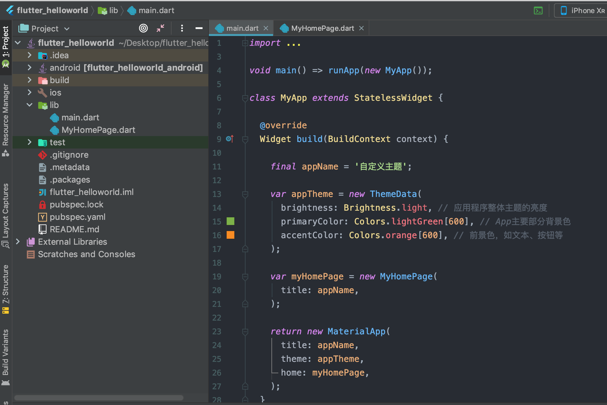

## 一 组件状态

无状态组件（Stateless Widget）是不可变的，即属性不能改变，所有的值都是最终的。  

有状态组件（Stateful Widget）持有的状态可能在Widget声明周期中发生改变，实现一个有状态组件至少需要两个类：
- StatefulWidget类
- State类，StatefulWidget类本身是不变的，但是State类在Widget生命周期中始终存在

在02-03章节中，我们自定义的MyHomePage必须继承自StatefulWidget类：
```dart
class MyHomePage extends StatelessWidget{}
```

重写createState方法：
```dart
@override
MyHomepageState createState() => new _MyHomepageState();
```

状态类也必须继承自 State 类：
```dart
class _MyHomepageState extends State<MyHomepage>
```

基于03章节案例，修改MyHomePage.dart文件为：
```dart
import 'package:flutter/foundation.dart';
import 'package:flutter/material.dart';

// MyHomePage 本身修改为继承自StatefulWidget，并重写 createState 方法
class MyHomePage extends StatefulWidget {

  final String title;

  MyHomePage({Key key, @required this.title}) : super(key: key);

  // 重写 createState方法
  @override
  _MyHomePageState createState() => new _MyHomePageState();

}

// 新建 _MyHomePageState 状态类，继承自State
class _MyHomePageState extends State<MyHomePage> {

  // 一个计数器示例
  int _count = 0;

  void _incrementCounter() {
    setState((){              // 调用State类里的setState方法，修改状态值，即计数器+1
      _count++;
    });
  }

  @override
  Widget build(BuildContext context) {

    return new Scaffold(

      appBar: new AppBar(
        title: new Text(widget.title),
      ),

      body: new Center(
        child: new Container(
          color: Theme.of(context).accentColor,     // 获取主题的accentColor
          child: new Text(
            '计数器值为：$_count',                    // 板顶计数器值
            style: Theme.of(context).textTheme.title,
          ),
        ),
      ),

      floatingActionButton: new FloatingActionButton(
        onPressed: _incrementCounter,             // 绑定按钮调用函数
        tooltip: 'Increment',
        child: new Icon(Icons.add),
      ),

    );
  }

}
```

展示效果：


## 二 第三方包的使用

flutter包类似Java的jar包，由全球开发者提供第三方库，所有的包（package）都发布在Dart的仓库中，在下面的网址输入包名查询即可：
- https://pub.dev/：谷歌原网址
- https://pub.flutter-io.cn/：国内镜像

假如现在我们要使用`url_launcher`这个包，步骤如下：
```
# 步骤一：打开pubspec.yaml文件，在dependencies下添加包名与版本
dependencies:
  flutter:
    sdk: flutter

  # The following adds the Cupertino Icons font to your application.
  # Use with the CupertinoIcons class for iOS style icons.
  cupertino_icons: ^0.1.2

  url_launcher: ^4.0.1

# 步骤二：安装包。
# 步骤一后会出现提示：使用packages get获取引用包，或者直接使用命令：flutter packages get

# 步骤三：引用包
import 'package:url_launcher/url_launcher.dart';

# 步骤四：使用包
const url = 'https://www.baidu.com';
launch(url);
```

## 三 flutter的网络请求

#### 3.0  两种请求方式

flutter的网络请求有两种方式：
- 使用Http请求
- 使用HttpClient请求

#### 3.1 Http请求方式

使用Http请求方式需要引入第三方包：http。
```
dependencies:
  flutter:
    sdk: flutter

  # The following adds the Cupertino Icons font to your application.
  # Use with the CupertinoIcons class for iOS style icons.
  cupertino_icons: ^0.1.2

  http:
```

设定点击按钮时发送请求：
```dart

// 引包
import 'package:http/http.dart' as http;

// 点击时触发请求
  onPressed: (){
          var url = 'https://www.baidu.com';
          http.get(url).then((response){
            print("状态： ${response.statusCode}");
            print("正文： ${response.body}");
          });
        },
```

点击后查看控制台输出。

#### 3.2 HttpClient请求方式

使用 HttpClient 方式请求时，需要导入io以及convert包。  

示例代码：
```dart
// 引包
import 'dart:convert';
import 'dart:io';

// 然后我们写一个发送请求的方法 getData
  void getData() async {
    try {

      Uri url = Uri.parse("https://www.baidu.com");

      // 发起请求
      HttpClient httpClient = new HttpClient();
      HttpClientRequest req = await httpClient.getUrl(url);

      // 等待返回数据
      HttpClientResponse res = await req.close();

      // 使用utf8.decoder 从 res中解析数据
      var data = await res.transform(utf8.decoder).join();

      // 输出响应头
      print(data);

      // 关闭请求客户端
      httpClient.close();

    } catch(e) {
      print("请求失败：$e");
    } finally {
      print("操作结束");
    }
  }

// 最后让按钮的点击触发该方法
 onPressed: getData,
```

#### 3.3 添加请求的查询

URI中可以直接添加查询参数：
```dart
Uri uri = Uri(
    scheme: "https",
    host: "www.baidu.com",
    queryParameters: {
        "id": 100021,
        "username": "lisi"
    }
);
```