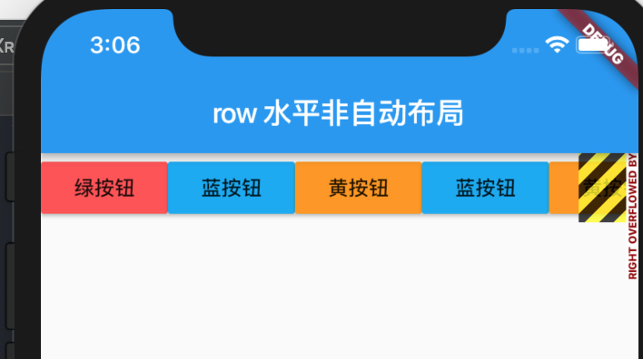

## 一 row 水平布局

row控件内部的子元素可以进行水平排列，进而可以利用row进行水平布局。  

#### 1.1 非自动布局

row默认按照子元素大小来排列，row子元素不足时，row会留有空隙，子元素数量超出，会报警告。  

比如如下示例：  
```dart
import 'package:flutter/material.dart';

void main() => runApp(new MyApp());

class MyApp extends StatelessWidget {
  @override
  Widget build(BuildContext context) {
    return MaterialApp(
      
      title: "test row",
      
      home: Scaffold(
        
        appBar: new AppBar(title: new Text("row 水平非自动布局"),),
        
        body: new Row(
          
          children: <Widget>[
            new RaisedButton(onPressed: (){}, color: Colors.redAccent, child: new Text("绿按钮"),),
            new RaisedButton(onPressed: (){}, color: Colors.lightBlue, child: new Text("蓝按钮"),),
            new RaisedButton(onPressed: (){}, color: Colors.orange, child: new Text("黄按钮"),),
            new RaisedButton(onPressed: (){}, color: Colors.lightBlue, child: new Text("蓝按钮"),),
            new RaisedButton(onPressed: (){}, color: Colors.orange, child: new Text("黄按钮"),)
          ],
          
        ),
        
      )
      
    );
  }
}
```

警告效果如图所示：  

  


#### 1.2 自动布局

如果想要自动布局，可以使用 `Expanded` 关键字解决：  

```dart
children: <Widget>[
            Expanded(
              child:  new RaisedButton(onPressed: (){}, color: Colors.redAccent, child: new Text("绿按钮"),),
            ),
            Expanded(
              child:  new RaisedButton(onPressed: (){}, color: Colors.lightBlue, child: new Text("蓝按钮"),),
            ),
            Expanded(
              child:  new RaisedButton(onPressed: (){}, color: Colors.orange, child: new Text("黄按钮"),),
            ),
          ],
```

#### 1.3 二者的灵活运用

非自动布局与自动布局可以互相搭配使用，比如为了让中间的按钮很宽，两边按钮自动布局。  